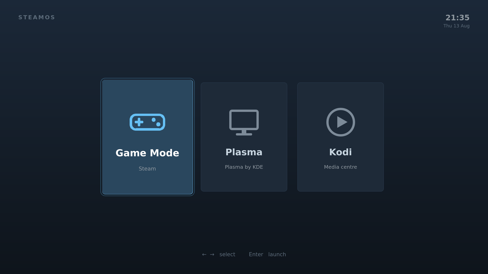

# steamos-session-picker

A boot-time session menu for SteamOS. Instead of logging straight into Game
Mode, the machine lands in a 10-foot menu and you pick where to go — Game Mode,
the desktop, a media centre — with a controller, a TV remote, a keyboard or a
mouse.



## Why

The Steam Machine is sold as a games console, and it is a good one. But look at
what it actually is: a small, quiet Linux computer, permanently attached to the
best screen in the house, woken by a controller you already have in your hand.
That machine could be a media centre, a retro-emulation box, a browser for the
sofa, a Jellyfin or Kodi front end — and the hardware is more than willing.

What is missing is a door. SteamOS boots into Steam and only into Steam, so
everything else has to be smuggled in *through* Steam, which is where the
trouble starts. This project adds the door: a menu, before the session starts,
listing everything the machine can boot into.

It does not install Kodi, or anything else. It gets you to whatever you have
installed, in a way that suits a couch and a television.

## Why not just add Kodi as a non-Steam game

That is the usual advice, and it works in the sense that pictures appear. It
also quietly costs you the two things you probably wanted a media centre for.

**HDR does not survive it.** For HDR to reach the television, three things have
to hold: the compositor must implement colour management, the player must ask
for it, and the session must not be nested inside gamescope. The last one is
where it breaks. Gamescope does not offer colour management to its clients —
there are no server-side `wp_color_management_v1` or `frog_color_management_v1`
globals in it at all. Its one HDR path is `gamescope_swapchain_factory_v2`,
spoken only by a Vulkan WSI layer, which a normal application does not use. So a
Kodi window inside Game Mode is an SDR window, no matter what Kodi itself is
capable of. Someone reported exactly this upstream, from the other direction:
*"Gamescope does support HDR… but that wasn't detected by Kodi"*
([xbmc#27490](https://github.com/xbmc/xbmc/issues/27490)).

**And it is a diminished thing besides.** The same report notes no hardware
decoding out of the box in Game Mode, and that Kodi cannot inhibit Valve's sleep
timers while a film is playing.

Run the same player as **its own session, next to Game Mode instead of inside
it**, and the constraints lift: KWin, which SteamOS already ships, does
implement colour management, so an HDR-capable player can actually get HDR.
Which is fine — except SteamOS gives you no way to choose that session at boot.
Hence this.

## What it does

- **Boots into a menu** rather than straight into Game Mode.
- **Finds sessions by itself.** The list comes from
  `steamosctl get-valid-desktop-sessions` and the desktop entries it names, so
  installing a new session makes it show up on the next boot with nothing edited
  here. Game Mode is added by hand, because SteamOS deliberately hides it from
  that list.
- **Takes any input the room has.** The controller works with no gamepad code at
  all: while Steam is not running — and in a login menu it is not — the puck
  presents itself as a plain USB keyboard and mouse. A TV remote arrives the
  same way through SteamOS's own CEC daemon.
- **Reuses Steam's own button.** Once the picker is the default desktop session,
  Steam's "Switch to Desktop" leads here too, so there is a way back without
  rebooting.
- **Looks like it belongs.** It runs immediately before Game Mode, so it uses
  Steam's palette and Big Picture's travelling focus rather than inventing a
  look of its own.

## Install

On the machine:

```sh
curl -fsSL https://raw.githubusercontent.com/VolanDeVovan/steamos-session-picker/main/bootstrap.sh | sh
```

That is the whole installation: it clones the repository into
`/opt/steamos-session-picker`, registers the session, and makes it the one the
machine boots into. Reboot and you are in the picker.

Doing it in one go is safe because SDDM on SteamOS runs with `Relogin=true`,
which would turn a picker that cannot start into an endless relogin loop — so
the entry point counts runs that produced nothing and, after three in a boot,
puts the machine back into Game Mode by itself.

The steps are still separate underneath, which is what you want when changing
anything:

```sh
cd /opt/steamos-session-picker
./install.sh            # the whole thing, same as the one-liner
./install.sh register   # register only, changing no defaults
./install.sh try        # start the picker once; a reboot puts things back
./install.sh enable     # make it the session the machine boots into
./install.sh disable    # back to Game Mode
./install.sh update     # git pull, then re-register
./install.sh uninstall  # remove every trace
```

Nothing here reboots; the picker appears at the next boot, or immediately via
Steam's "Switch to Desktop", or with `./install.sh try`.

Nothing is compiled, no packages are installed, and the read-only rootfs is
never touched: SteamOS already ships `qml` and `kwin_wayland`, which is the
entire runtime.

Nor is any configuration overridden. SDDM and `steamos-manager` both already
search `/usr/local/share`, which happens to sit on the read-only rootfs — so
instead of reconfiguring either of them, the session entry is added to that
directory through an overlay mount, the same mechanism SteamOS uses for `/etc`.
Existing contents stay visible, and after an OS update the new rootfs simply
becomes the lower layer. The one unit in `/etc/systemd/system` is on SteamOS's
default atomic-update keep list, so it survives updates on its own. The details,
including why the overlay's upper layer cannot live on the home partition, are
in [docs/install.md](docs/install.md).

## Adding a session

There is nothing to add here. Register a session with SteamOS the normal way —
a `.desktop` file in a directory SDDM and `steamos-manager` look at — and the
picker will list it, using the entry's `Name` and `Comment`.

## How it works

| Topic | |
|---|---|
| How SteamOS decides which session to start, and the pitfalls | [docs/mechanism.md](docs/mechanism.md) |
| Installing on an immutable OS, and what survives updates | [docs/install.md](docs/install.md) |
| Controller, TV remote, keyboard, mouse | [docs/input.md](docs/input.md) |
| The choice protocol, and how this is developed and tested | [docs/development.md](docs/development.md) |

## Status

Early. The interface, the session discovery and the choice protocol have been
built and exercised, including with a real Steam Controller; the layout is
checked by rendering it headlessly at 720p, 1080p and 4K.

What has **not** happened yet is an end-to-end run on a Steam Machine: the
picker has never been installed on one. Everything in `docs/` marks plainly
which facts were read off real hardware and which were not.
